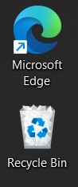

# Remove Global Desktop Shortcuts

Tired of software upgrades putting unnecessary shortcuts on your desktop? Here's the solution for you!

## Installation

### Windows 8, 10 and 11 (Tested on Windows 10)

1. Press `Start`, type `Run`, and press `Enter`.
2. In the Run window, type `shell:startup` and click `OK`
3. Once the Startup folder is opened, copy `remove-global-desktop-shortcuts.bat` into that folder.

*Note:* This will delete all shortcuts (*.lnk) created at the global level. It shouldn't delete any created by you for your user only.